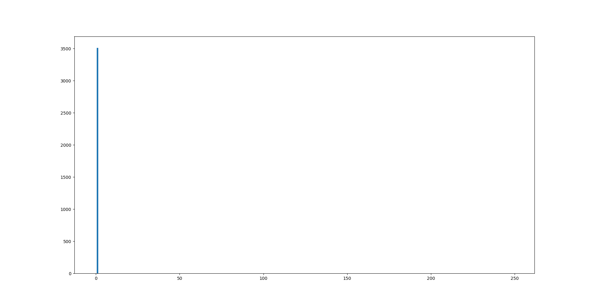
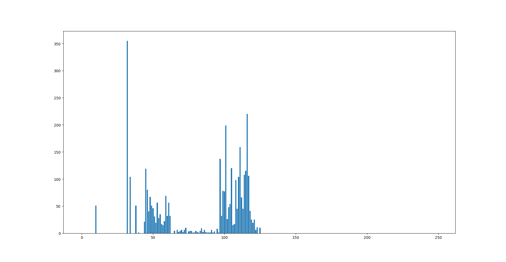
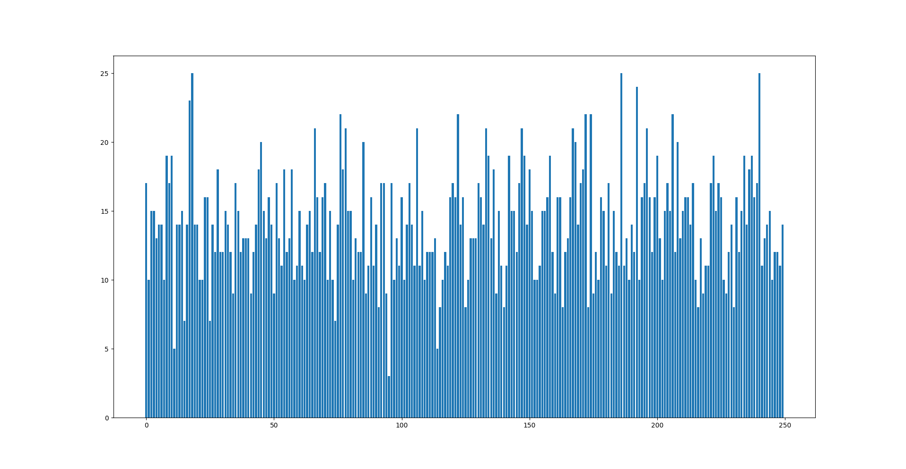
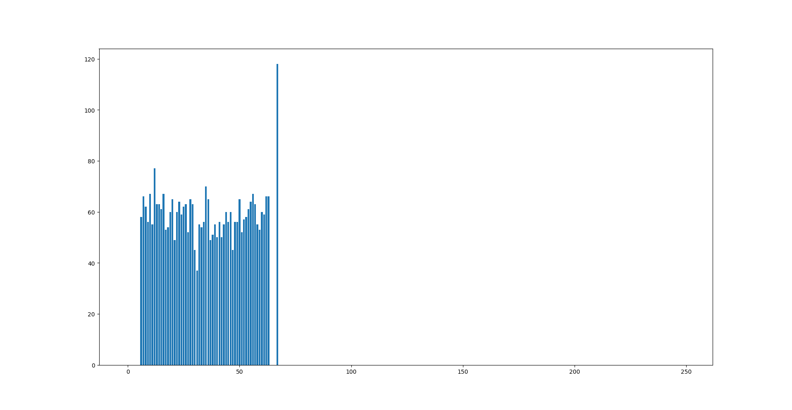
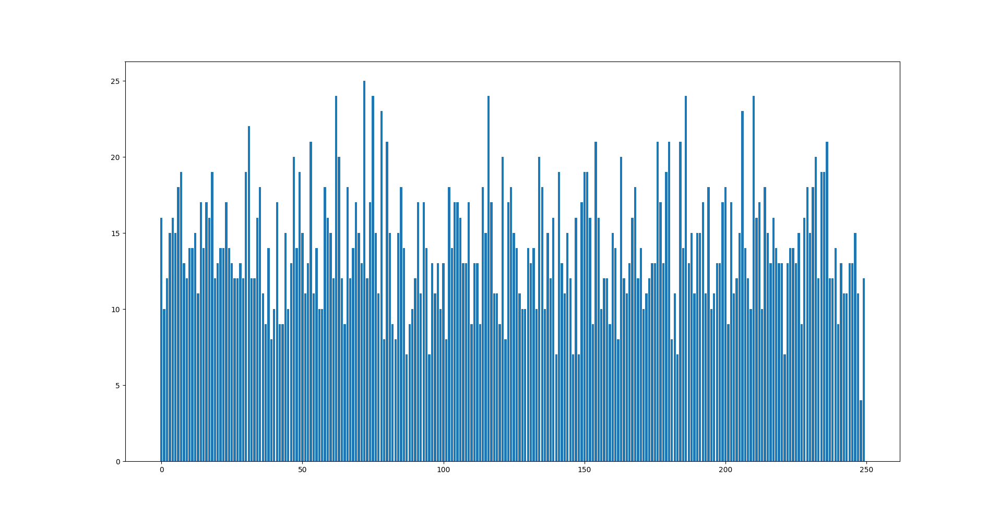
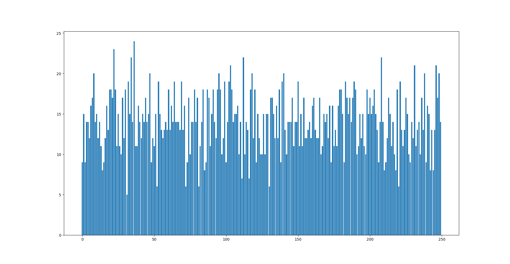

# gHashSet
HashSet data structure based on `gList` and `gObjPool`.

# Implementation
`gHashSet` uses internal `gList` (double-linked list based on `gObjPool`) to provide limited c-string set with pointer values.
`gObjPool` had major changes in memory representation. Now it has a basic bulk-array inside that meant to reduce memory fragmentation and guaranty mempage alignment.

# Testing
## Accuracy testing
Limited GoogleTest framework is used to crosscheck `gHashSet` with `std::map` by filling it up with random keys and values, ejecting some of it and then refilling with new random keys. Github Actions runners with different compilation flags. Overall gHashSet test coverage is 90% linewise.
## Benchmark
Benchmark consists of loading HashSet with values from War And Peace novel, and 10000 searches of random keys, most of which are unsuccessful and create heavier load on `gHashSet_find`.
Each key is searched 10000 times, so key fillup time is insignificant.

# Hashes
The task includes comparison of different hashes in spectral test on the same War And Peace novel (len of chains by number of table cell).

return one:

return ascii of last:

return sum (while it may seem like a pretty nice hash, in real life hashtable wouldn't be overloaded and sum would only cover a part of the table):

return len:

rol hash:

crc32 hash:

# Optimizations
## Safety checks
First of all, I had to fix all the safety checks I forgot about in `gObjPool` and `gList`. This improved performance by 15%.
## ObjPool getters
Functions like `gObjPool_idVal` were no longer called, but `gObjPool_get` was everywhere and it was not inlining, thus I decided to put address calculation (the only useful thing it did) into an unsafe macro, which was called from another macro with additional checks.
It improved benchmark numbers by another 20%.
## Strncmp
The next thing that caught my eye in callgrind was `strncmp_avx2`, while it was improved by compiler by utilizing AVX2 instructions, it still took about 35% of all time. I decided to use my fancy new processor with novel AVX512 instructions to compare two keys in one opcode.
Thus I needed to limit key len to only 64 bytes, which seemed more than enough for the task. That is when I faced a major challenge, because unsurprisingly AVX512 opcodes operating 64 bytes at a time strongly insisted on 64 byte alignment.
I decided that it was a good moment to try out ObjPool on Bulk Array, with allocating full mempages and operating on them. This should have solved the fragmentation problem, if I had faced one, and slowed my programs on boundary cases because of cache unfriendliness.
Along with that I had to force usage of aligned structures to hold keys on the outside, and successfully put them into yet another macro.
Memcmp instead of strncmp on non-aligned data showed 5% increase.
Memcmp on aligned data was even 10% faster.
My custom avx512 comparison function improved results by another 10%.
## Hashes
It was clear that a decent amount of time goes to hash calculations, as I decided to make it byte-by-byte, there wasn't too much room for improvement, but it was quite interesting to find the best.
The candidates were:
- rol hash in c
- rol hash with assembly insertion
- crc32 with intrinsic

Here is the comparison table on the fastest version of `gHashSet`, with AVX512 instructions
Hash | rol | rol_asm | crc32 |
---  | --- | ------- | ----- |
Time | 8.2 |   6.7   |  7.8  |

It seems to me that crc32 and rol_asm are both very fast one-opcode hashes, but crc32 is generally more complicated and thus a bit slower in general use.
As rol_asm has a very fine distribution considering the task, I decided to stick with it.

## Const PAGE_SIZE
All the address calculations in ObjPool that are in great numbers in this program use PAGE_SIZE value to find the correct mempage for an pool id.
Thus, I was pretty much shocked when my buddy suggested that I use a literally const page size instead of a system function that returned 4096. Why would it matter? PageSize is a power of two, as
is a size of `gObjPool_Node` and thus compiler having a knowledge of this replaces all the divs with bit shifts.
The thing was very obvious, but had to be pointed out to me by someone, showing that the best optimization for me was a good night of sleep...
Anyway, this alone improved my programs speed by 30% and became the end of the struggle.
